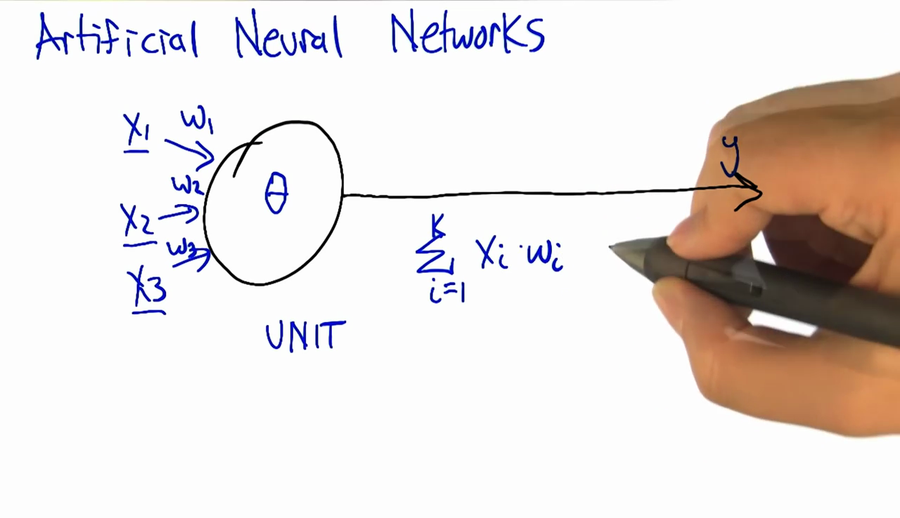

# Learning & Loss

Like MiniFlow in its current state, neural networks take inputs and produce outputs. But unlike MiniFlow in its current state, neural networks can improve the accuracy of their outputs over time (it's hard to imagine improving the accuracy of Add over time!). To explore why accuracy matters, I want you to first implement a trickier (and more useful!) node than Add: the Linear node.

***

### The Linear Function



As described by Charles and Michael, a Neuron calculates the weighted sum of its inputs.

Think back to Neural Networks lesson with Charles and Michael. A simple artificial neuron depends on three components:

- inputs, x (vector)
- weights, w (vector)
- bias, b (scalar)

The output, o, is just the weighted sum of the inputs plus the bias:


Equation (1)

Remember, by varying the weights, you can vary the amount of influence any given input has on the output. The learning aspect of neural networks takes place during a process known as back-propagation. In back-propagation, the network modifies the weights to improve the network's output accuracy. You'll be applying all of this shortly.

In this next quiz, you'll try to build a linear neuron that generates an output by applying a simplified version of Equation (1). *Linear* should take an list of inbound nodes of length n, a list of weights of length n, and a bias.

#### Instructions

1. Open nn.py below. Read through the neural network to see the expected output of Linear.
2. Open miniflow.py below. Modify Linear, which is a subclass of Node, to generate an output with Equation (1).

(Hint: you could use numpy to solve this quiz if you'd like, but it's possible to solve this with vanilla Python.)

nn.py:

```python
"""
NOTE: Here we're using an Input node for more than a scalar.
In the case of weights and inputs the value of the Input node is
actually a python list!

In general, there's no restriction on the values that can be passed to an Input node.
"""
from miniflow import *

inputs, weights, bias = Input(), Input(), Input()

f = Linear(inputs, weights, bias)

feed_dict = {
    inputs: [6, 14, 3],
    weights: [0.5, 0.25, 1.4],
    bias: 2
}

graph = topological_sort(feed_dict)
output = forward_pass(f, graph)

print(output) # should be 12.7 with this example
```

miniflow.py:

```python
"""
Write the Linear#forward method below!
"""


class Node:
    def __init__(self, inbound_nodes=[]):
        # Nodes from which this Node receives values
        self.inbound_nodes = inbound_nodes
        # Nodes to which this Node passes values
        self.outbound_nodes = []
        # A calculated value
        self.value = None
        # Add this node as an outbound node on its inputs.
        for n in self.inbound_nodes:
            n.outbound_nodes.append(self)

    # These will be implemented in a subclass.
    def forward(self):
        """
        Forward propagation.

        Compute the output value based on `inbound_nodes` and
        store the result in self.value.
        """
        raise NotImplemented


class Input(Node):
    def __init__(self):
        # An Input Node has no inbound nodes,
        # so no need to pass anything to the Node instantiator
        Node.__init__(self)

        # NOTE: Input Node is the only Node where the value
        # may be passed as an argument to forward().
        #
        # All other Node implementations should get the value
        # of the previous nodes from self.inbound_nodes
        #
        # Example:
        # val0 = self.inbound_nodes[0].value
    def forward(self, value=None):
        # Overwrite the value if one is passed in.
        if value is not None:
            self.value = value


class Linear(Node):
    def __init__(self, inputs, weights, bias):
        Node.__init__(self, [inputs, weights, bias])

        # NOTE: The weights and bias properties here are not
        # numbers, but rather references to other nodes.
        # The weight and bias values are stored within the
        # respective nodes.

    def forward(self):
        """
        Set self.value to the value of the linear function output.

        Your code goes here!
        """
        inputs = self.inbound_nodes[0].value
        weights = self.inbound_nodes[1].value
        bias = self.inbound_nodes[2].value
        self.value = bias
        for x, w in zip(inputs, weights):
            self.value += x * w


def topological_sort(feed_dict):
    """
    Sort the nodes in topological order using Kahn's Algorithm.

    `feed_dict`: A dictionary where the key is a `Input`
    Node and the value is the respective value feed to that Node.

    Returns a list of sorted nodes.
    """

    input_nodes = [n for n in feed_dict.keys()]

    G = {}
    nodes = [n for n in input_nodes]
    while len(nodes) > 0:
        n = nodes.pop(0)
        if n not in G:
            G[n] = {'in': set(), 'out': set()}
        for m in n.outbound_nodes:
            if m not in G:
                G[m] = {'in': set(), 'out': set()}
            G[n]['out'].add(m)
            G[m]['in'].add(n)
            nodes.append(m)

    L = []
    S = set(input_nodes)
    while len(S) > 0:
        n = S.pop()

        if isinstance(n, Input):
            n.value = feed_dict[n]

        L.append(n)
        for m in n.outbound_nodes:
            G[n]['out'].remove(m)
            G[m]['in'].remove(n)
            # if no other incoming edges add to S
            if len(G[m]['in']) == 0:
                S.add(m)
    return L


def forward_pass(output_node, sorted_nodes):
    """
    Performs a forward pass through a list of sorted nodes.

    Arguments:

        `output_node`: A node in the graph, should be the output node (have no outgoing edges).
        `sorted_nodes`: A topologically sorted list of nodes.

    Returns the output Node's value
    """

    for n in sorted_nodes:
        n.forward()

    return output_node.value

```

In the solution, I set self.value to the bias and then loop through the inputs and weights, adding each weighted input to self.value. Notice calling .value on self.inbound_nodes[0] or self.inbound_nodes[1] gives us a list.
