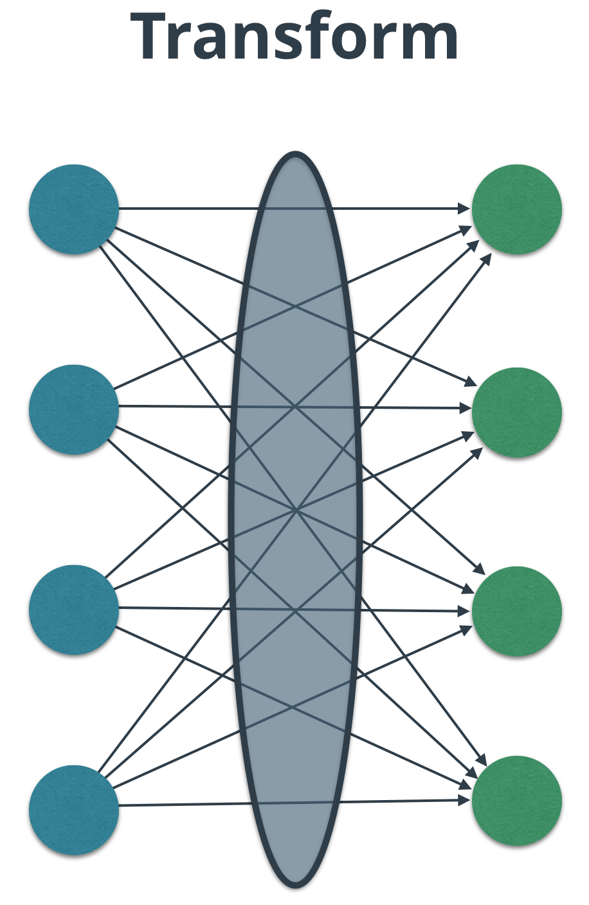
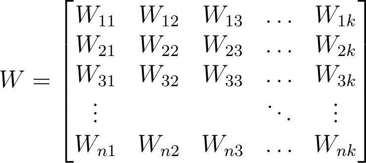
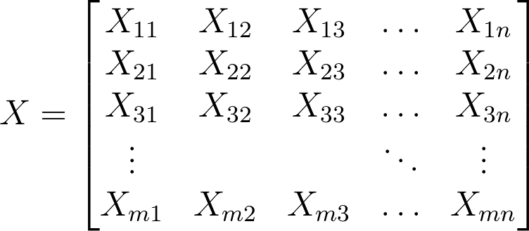

# Linear Transform



Shift your thinking to the edges between layers

Linear algebra nicely reflects the idea of transforming values between layers in a graph. In fact, the concept of a transform does exactly what a layer should do - it converts inputs to outputs in many dimensions.

Let's go back to our equation for the output.


For the rest of this section we'll denote x as X and w as W since they are now matrices, and b is now a vector instead of a scalar.

Consider a Linear node with 1 input and k outputs (mapping 1 input to k outputs). In this context an input/output is synonymous with a feature.

In this case X is a 1 by 1 matrix.


1 by 1 matrix, 1 element

W becomes a 1 by k matrix (looks like a row).


A 1 by k weights row matrix

The result of the matrix multiplication of X and W is a 1 by k matrix. Since b is also a 1 by k row matrix (1 bias per output), b is added to the output of the X and W matrix multiplication.

What if we are mapping n inputs to k outputs?

Then X is now a 1 by n matrix and W is a n by k matrix. The result of the matrix multiplication is still a 1 by k matrix so the use of the biases remain the same.


X is now a 1 by n matrix, n inputs/features



W is now a n by k matrix


Row matrix of biases, one for each output

Let's take a look at an example of n inputs. Consider an 28px by 28px grayscale image, as is in the case of images in the MNIST dataset. We can reshape the image such that it's a 1 by 784 matrix, n = 784. Each pixel is an input/feature.

In practice, it's common to feed in multiple data examples in each forward pass rather than just 1. The reasoning for this is the examples can be processed in parallel, resulting in big performance gains. The number of examples is called the batch size. Common numbers for the batch size are 32, 64, 128, 256, 512. Generally, it's the most we can comfortably fit in memory.

What does this mean for X, W and b?

X becomes a m by n matrix and W and b remain the same. The result of the matrix multiplication is now m by k, so the addition of b is broadcast over each row.



X is not an m by n matrix. Each row has n inputs/features

In the context of MNIST each row of X is an image reshaped from 28 by 28 to 1 by 784.

Equation (1) turns into:


Equation (2)

Equation (2) can also be viewed as Z = XW + B where B is the biases vector, b, stacked m times as a row. Due to broadcasting it's abbreviated to Z = XW + b.

I want you to rebuild Linear to handle matrices and vectors using the venerable Python math package numpy to make your life easier. numpy is often abbreviated as np, so we'll refer to it as np when referring to code.

I used np.array (documentation) to create the matrices and vectors. You'll want to use np.dot, which functions as matrix multiplication for 2D arrays (documentation), to multiply the input and weights matrices from Equation (2). It's also worth noting that numpy actually overloads the __add__ operator so you can use it directly with np.array (eg. np.array() + np.array()).

nn.py:

```python
"""
The setup is similar to the prevous `Linear` node you wrote
except you're now using NumPy arrays instead of python lists.

Update the Linear class in miniflow.py to work with
numpy vectors (arrays) and matrices.

Test your code here!
"""

import numpy as np
from miniflow import *

X, W, b = Input(), Input(), Input()

f = Linear(X, W, b)

X_ = np.array([[-1., -2.], [-1, -2]])
W_ = np.array([[2., -3], [2., -3]])
b_ = np.array([-3., -5])

feed_dict = {X: X_, W: W_, b: b_}

graph = topological_sort(feed_dict)
output = forward_pass(f, graph)

"""
Output should be:
[[-9., 4.],
[-9., 4.]]
"""
print(output)

```

miniflow.py:

```python
"""
Modify Linear#forward so that it linearly transforms
input matrices, weights matrices and a bias vector to
an output.
"""

import numpy as np


class Node(object):
    def __init__(self, inbound_nodes=[]):
        self.inbound_nodes = inbound_nodes
        self.value = None
        self.outbound_nodes = []
        for node in inbound_nodes:
            node.outbound_nodes.append(self)

    def forward():
        raise NotImplementedError


class Input(Node):
    """
    While it may be strange to consider an input a node when
    an input is only an individual node in a node, for the sake
    of simpler code we'll still use Node as the base class.

    Think of Input as collating many individual input nodes into
    a Node.
    """
    def __init__(self):
        # An Input node has no inbound nodes,
        # so no need to pass anything to the Node instantiator
        Node.__init__(self)

    def forward(self):
        # Do nothing because nothing is calculated.
        pass


class Linear(Node):
    def __init__(self, X, W, b):
        # Notice the ordering of the input nodes passed to the
        # Node constructor.
        Node.__init__(self, [X, W, b])

    def forward(self):
        """
        Set the value of this node to the linear transform output.

        Your code goes here!
        """
        inputs = self.inbound_nodes[0].value
        weights = self.inbound_nodes[1].value
        bias = self.inbound_nodes[2].value
        self.value = np.dot(inputs, weights) + bias


def topological_sort(feed_dict):
    """
    Sort the nodes in topological order using Kahn's Algorithm.

    `feed_dict`: A dictionary where the key is a `Input` Node and the value is the respective value feed to that Node.

    Returns a list of sorted nodes.
    """

    input_nodes = [n for n in feed_dict.keys()]

    G = {}
    nodes = [n for n in input_nodes]
    while len(nodes) > 0:
        n = nodes.pop(0)
        if n not in G:
            G[n] = {'in': set(), 'out': set()}
        for m in n.outbound_nodes:
            if m not in G:
                G[m] = {'in': set(), 'out': set()}
            G[n]['out'].add(m)
            G[m]['in'].add(n)
            nodes.append(m)

    L = []
    S = set(input_nodes)
    while len(S) > 0:
        n = S.pop()

        if isinstance(n, Input):
            n.value = feed_dict[n]

        L.append(n)
        for m in n.outbound_nodes:
            G[n]['out'].remove(m)
            G[m]['in'].remove(n)
            # if no other incoming edges add to S
            if len(G[m]['in']) == 0:
                S.add(m)
    return L


def forward_pass(output_node, sorted_nodes):
    """
    Performs a forward pass through a list of sorted Nodes.

    Arguments:

        `output_node`: A Node in the graph, should be the output node (have no outgoing edges).
        `sorted_nodes`: a topologically sorted list of nodes.

    Returns the output node's value
    """

    for n in sorted_nodes:
        n.forward()

    return output_node.value

```

Nothing fancy in my solution. I pulled the value of the X, W and b from their respective inputs. I used np.dot to handle the matrix multiplication.

Neural networks take advantage of alternating transforms and activation functions to better categorize outputs. The sigmoid function is among the most common activation functions.
