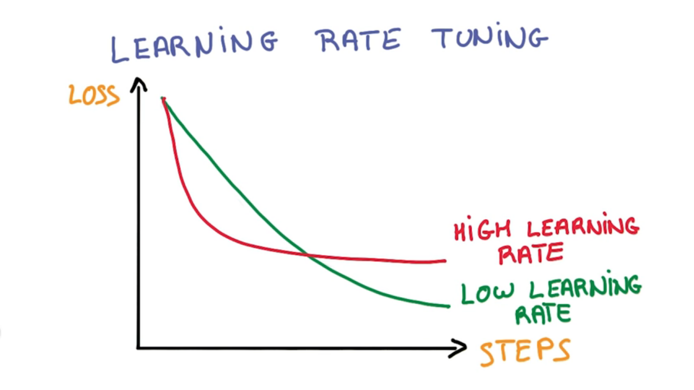

# Learning Rate Tuning

Having a higher learning rate doesn't mean your program will learn any faster. As you can see in the above picture, the higher learning rate learns quickly at first but plateaus sooner than the lower learning rate.

**Never trust how quickly you learn, it often has little to do with how well you train**

***

### SGD "Black Magic"

SGD has many *Hyper-Parameters* that can be used to improve your algorithm:

- Initial learning-rate
- Learning rate decay
- Momentum
- Batch size
- weight initialization

**Tip**: When things don't work, always try to lower the learning rate first

***

There are lots of good solutions for small models, but none that are completely satisfactory so far for he very large models that we really care about

#### ADAGRAD Approach

ADAGRAD is a modification of SGD which implicitly does momentum and learning rate decay for you. Using ADAGRAD often makes learning less sensitive to hyper-parameters, but it often tends to be a little worse than precisely tuned SDG with momentum. It is a good option if you are just trying to get things to work. 

***

### Recap

We have this very simple linear model which emits probabilities which we can use to classify things. We can optimize its parameters on lots and lots of data using SGD and its variants. It is still a linear shallow model, but it is good prep for deep learning.
