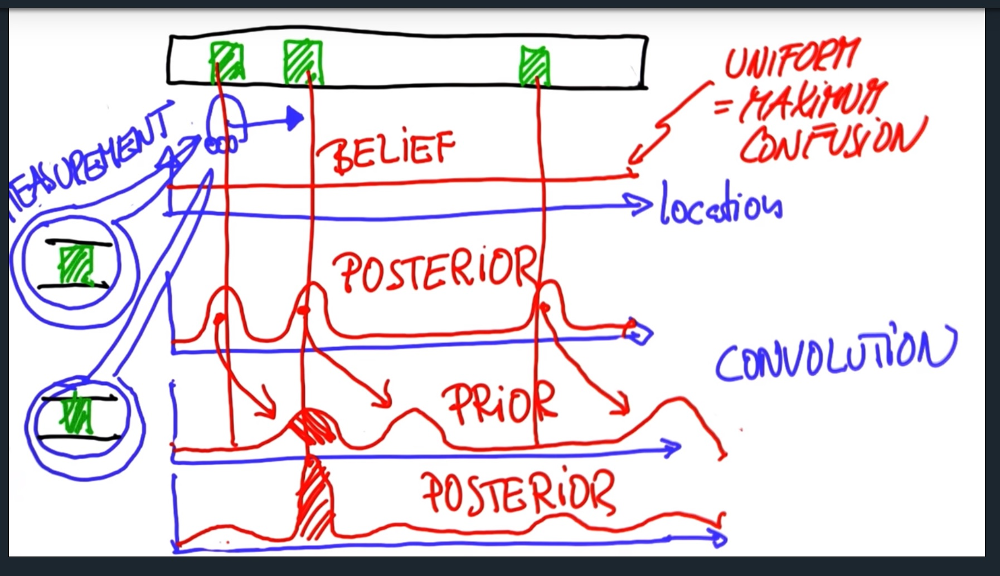

# Motion Update - Total Probability

In the above image, you can see that we have a car trying to understand the world around it

The horizontal axis represents all the places in the 1-dimensional world

The way we model the robot's current belief about where it might be (its confusion) is by a uniform function that assigns equal weight to every possible place in this world. That is the state of maximum confusion. 

The measurement of the door transforms our belief function defined over possible locations to a new function seen in the Posterior graph. For the three locations adjacent to doors, we have an increased belief while all the other locations have a decreased belief. "Posterior" means that it is after a measurement has been taken.

We still don't know where we are, the sensors could be wrong, but the three bumps in the graph represent our best belief of where we are (localization)

If the car moves to the right, we can shift the belief according to the motion as seen in the third graph. The car can use this new data to determine how far it has moved and the direction of its movement. Since we are a little bit more unsure when we move, our Gaussian distributions for each door are wider in the movement graphs. The process of moving our beliefs to the right is called a *Convolution*.

We then multiply our belief (our second measurement graph) with a function that looks like the last graph at the bottom of the image. The big bump in the forth graph corresponds to the first bump in the third graph (the Prior), and it is the only place in the Prior that corresponds to the measurement since they both have bumps. The forth distribution focuses most of its weight onto the robot being by the second door. At this point the car has localized itself.
