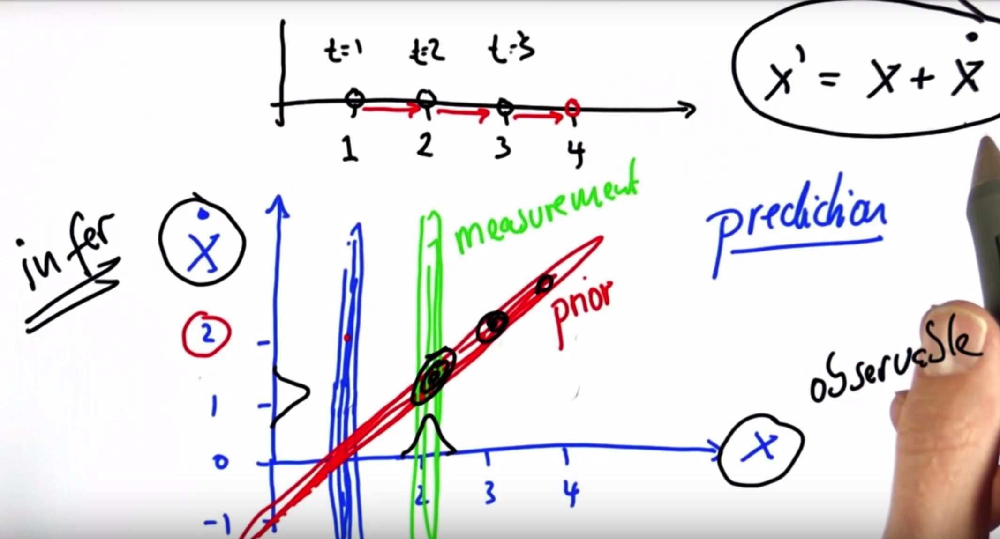

# Kalman Filter Predictions

### High-Dimensional/Multivariate Gaussians

In these high-dimensional Gaussians the mean is not a vector with 1 element for each of the dimensions

The variance^2 is replaced by what is called a covariance and it is a matrix with D rows and D columns if the diensionality of the estimate is D.

***

### 2-Dimensional Gaussian

Image we have two Gaussian distributions - one for velocity, and one for location. Each of these Gaussians has its own uncertainty. If we put these Gaussians together into one Gaussian, the overlapp will form a new Gaussian that will be much more certain than either of the original Gaussians.

***

### Big Lesson

The variables of a Kalman Filter are called **states** because they reflect states of the physical world, like where other cars are and how fast they are moving

States separate into two subsets:

Observables - like momentary location

Hidden - like velocity, which we can never directly observe

Because these two kinds of states interact, subsequent observations of the observable variables give us information about these hidden variables so we can estimate what our hidden variables are. In other words, we look at the observable variable "location" to determine the hidden variable "velocity".
