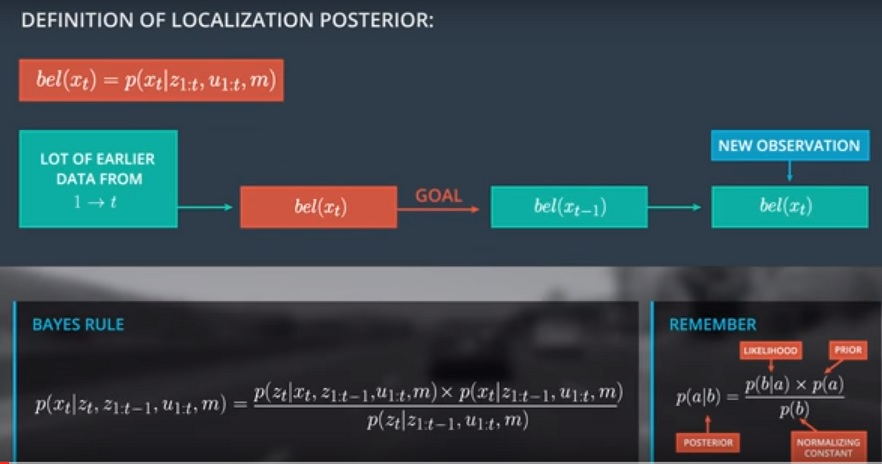

# Bayes Rule & Law Of Total Probability



In the bottom-left corner of the above image you can see the resut of applying Bayes rule for the localization posterior. To define the likelihood term we swap the state and the observation at **t** and also take into account all other conditions. The prior and the normalizer are also conditioned by the previous observations, all controls, and the map. It is fine to condition Bayes rule on arbitrary variables like the controls, like our observations, and the map.

If you remove the additional conditions in the posterior you would end up exactly with the general Bayes formula. We call the likelihood terms observation model, which describes the probability distribution of the observation vector **t**. Another assumption, that the state **x_t**, all the previous observations, all controls, and the map are given.

The prior is called the motion model. It is a probability distribution of **x_t**, given all observations from 1 to **t - 1**, all controls, and the map. Take into account that no current observations are included in the motion model. To simplify the normalization part, we defined the normalizer as **eta**. **Eta** is 1 over the original normalization term, and this term is a sum of the products of the observation and the motion model over all possible states **x_t_i**. This also means you only have to define the observation and motion model to estimate the beliefs.

***

### Definition Of Motion Model

```
p(x_t|z_1:t-1, u_1:t, m)
```

The problem with this definition is that we have no information where the car was before at time **t - 1**. This means no information about the previous state **x_(t-1)**. What kind of rule or law can we use which will help us here?

In this case the law of Total Probability will help - this has nothing to do with Bayes rule


We introduce a state **x_t - 1** and assume the state is given. Then, the probability distribution of our motion model can be expressed as the integral of **p(x_t)** given the previous states **x_(t-1)**, the previous observations **z_(1:t - 1)**, our controls **u_(1:t - 1)**, and the map **m** all multiplied by the probability distribution of the previous state itself divided by the whole state space **x_(t - 1)**.

For better understanding, assume you only have **p** of **x_t** and you introduce **p(x_(t - 1))**. Then you would have inside the integral **p(x_t)** given **x_(t - 1)** and the probability distribution of **p(x_(t - 1))** itself. This is exactly the same as the example seen in the bottom right corner of the above image. But, since we have conditions in our target distribution, you also have to consider them in the first and second term.


The above graph is a visualization of the dependencies between the robots. Since we introduced **x_(t - 1)**, we are looking at all possible states of the previous time step, and then we predict where the car will be in the next time step denoted **x_t**. Since we also have all the other given values (shown in the green boxes), we also use this information to estimate **x_t**. The same information is also used to estimate **x_(t - 1)** itself. Of course, **x_(t-1)** is unknown. Our goal is to simplify this relation by using meaningful assumptions.

### Markov Assumption For Motion Model Quiz

Since we (hypothetically) know in which state the system is at time step **t-1**, the past observations **z_1:t−1** and controls **u_1:t−1** would not provide us additional information to estimate the posterior for **x_t** because they were already used to estimate **x_t−1**. This means, I can simplify **p(x_t∣x_t−1,z_1:t−1, u_1:t, m)** to **p(x_t∣x_t−1, u_t, m)**.

Since **u_t** is “in the future” with reference to **x_t−1**, **u_t** does not tell us much about **x_t−1**. This means the term **p(x_t−1∣z_1:t−1, u_1:t, m)** can be simplified to **p(x_t−1∣z_1:t−1, u_1:t−1, m).
