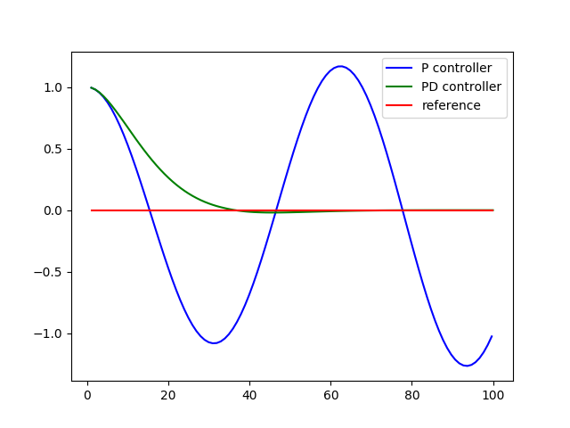

# PD Controller

Is there a way to avoid the overshoot? It would be nice if we could do this because driving in an oscillating car can make people sick. The trick to solve this problem is called the **PD-Control**.

In PD-Control my steering **alpha** is not just related to the cross track error by virtue of the gain parameter **tau_p**, but also to the temporal derivative of the cross track error. What this means is that when the car has turned enough to reduce the cross track error, it won't just go shooting for the **x**-axis, but it will notice that it's already reducing the error. The error is becoming smaller over time, it counter steers, it steers up again, and this will allow it to gracefully approach our target trajectory, assuming appropriate settings of our differential gain - **tau_d** versus the proportional gain **tau_p**. But how do we compute this derivative? At time **t** this is the same as the cross track error at time **t - the cross track error at time t-1 divided by the time span between t and t-1**. In our code we assume **delta_t** equals 1, so we can omit this. The difference of the current cross track error and the previous one is the term **d/dt * cross track error**. We now control not just in proportion to the error itself, but also to this difference of the error using a second constant **tau d**.

### Code

```python
# Implement a PD controller by running 100 iterations
# of robot motion. The steering angle should be set
# by the parameter tau_p and tau_d so that:
#
# steering = -tau_p * CTE - tau_d * diff_CTE
# where differential crosstrack error (diff_CTE)
# is given by CTE(t) - CTE(t-1)
 
import random
import numpy as np
import matplotlib.pyplot as plt

# Robot class
class Robot(object):
    def __init__(self, length=20.0):
        """
        Creates robot and initializes location/orientation to 0, 0, 0.
        """
        self.x = 0.0
        self.y = 0.0
        self.orientation = 0.0
        self.length = length
        self.steering_noise = 0.0
        self.distance_noise = 0.0
        self.steering_drift = 0.0

    def set(self, x, y, orientation):
        """
        Sets a robot coordinate.
        """
        self.x = x
        self.y = y
        self.orientation = orientation % (2.0 * np.pi)

    def set_noise(self, steering_noise, distance_noise):
        """
        Sets the noise parameters.
        """
        # makes it possible to change the noise parameters
        # this is often useful in particle filters
        self.steering_noise = steering_noise
        self.distance_noise = distance_noise

    def set_steering_drift(self, drift):
        """
        Sets the systematical steering drift parameter
        """
        self.steering_drift = drift

    def move(self, steering, distance, tolerance=0.001, max_steering_angle=np.pi / 4.0):
        """
        steering = front wheel steering angle, limited by max_steering_angle
        distance = total distance driven, most be non-negative
        """
        if steering > max_steering_angle:
            steering = max_steering_angle
        if steering < -max_steering_angle:
            steering = -max_steering_angle
        if distance < 0.0:
            distance = 0.0

        # apply noise
        steering2 = random.gauss(steering, self.steering_noise)
        distance2 = random.gauss(distance, self.distance_noise)

        # apply steering drift
        steering2 += self.steering_drift

        # Execute motion
        turn = np.tan(steering2) * distance2 / self.length

        if abs(turn) < tolerance:
            # approximate by straight line motion
            self.x += distance2 * np.cos(self.orientation)
            self.y += distance2 * np.sin(self.orientation)
            self.orientation = (self.orientation + turn) % (2.0 * np.pi)
        else:
            # approximate bicycle model for motion
            radius = distance2 / turn
            cx = self.x - (np.sin(self.orientation) * radius)
            cy = self.y + (np.cos(self.orientation) * radius)
            self.orientation = (self.orientation + turn) % (2.0 * np.pi)
            self.x = cx + (np.sin(self.orientation) * radius)
            self.y = cy - (np.cos(self.orientation) * radius)

    def __repr__(self):
        return '[x=%.5f y=%.5f orient=%.5f]' % (self.x, self.y, self.orientation)

def run(robot, tau_p, tau_d, n=100, speed=1.0):
    x_trajectory = []
    y_trajectory = []
    prev_cte = robot.y
    for i in range(n):
        cte = robot.y
        diff_cte = cte - prev_cte
        prev_cte = cte
        steer = -tau_p * cte - tau_d * diff_cte
        robot.move(steer, speed)
        x_trajectory.append(robot.x)
        y_trajectory.append(robot.y)
    return x_trajectory, y_trajectory

# previous P controller
def run_p(robot, tau, n=100, speed=1.0):
    x_trajectory = []
    y_trajectory = []
    for i in range(n):
        cte = robot.y
        steer = -tau * cte
        robot.move(steer, speed)
        x_trajectory.append(robot.x)
        y_trajectory.append(robot.y)
    return x_trajectory, y_trajectory
    
robot = Robot()
robot.set(0, 1, 0)

def run(robot, tau_p, tau_d, n=100, speed=1.0):
    x_trajectory = []
    y_trajectory = []
    # TODO: your code here
    return x_trajectory, y_trajectory
    
x_trajectory, y_trajectory = run(robot, 0.2, 3.0)
n = len(x_trajectory)

fig, (ax1, ax2) = plt.subplots(2, 1, figsize=(8, 8))
ax1.plot(x_trajectory, y_trajectory, 'g', label='PD controller')
ax1.plot(x_trajectory, np.zeros(n), 'r', label='reference')
```

This is very similar to the P controller. We've added the **prev_cte** variable which is assigned to the previous CTE and **diff_cte**, the difference between the current CTE and previous CTE. We then put it all together with the new **tau_d** parameter to calculate the new steering value, **-tau_p * cte - tau_d * diff_cte**.



```
cross_track_error = myrobot.y
for i in range(N):
	diff_cross_track_error = myrobot.y - cross_track_error
	cross_track_error = myrobot.y
	steer = - param1 * crosstrack_error \ - param2 * diff_cross_track_error
	myrobot = myrobot.move(steer, speed)
	print myrobot, steer
```
