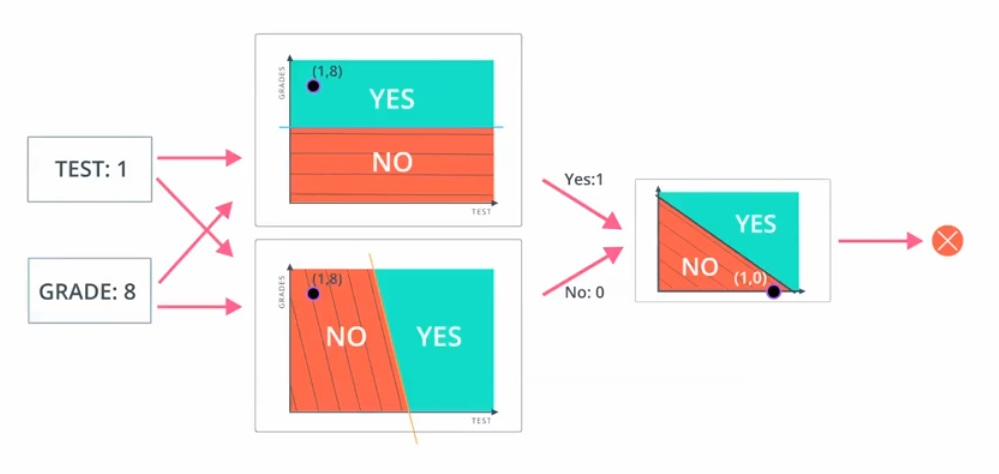

#Neural Networks

Previously we have looked at Logistic Regression where we create a single model line to divide our data into one of two classes

A Neural Network does this Logistic Regression over and over creating many different lines on a graph, or only a few if many are not needed

To create multiple lines on our graph we have to ask multiple questions, much like a decision tree.

In the above picture you can see our two inputs on the left, the hidden layer in the middle, and our output layer on the right

The two questions we ask are: What is the test score, and what is the grade. The test score is used as a x-coordinate and the grade is used as a y-coordinate.

This (x,y) data point gets sent to our hidden layer where we answer the questions we defined earlier. We have a separate graph for each of our questions that each result in an answer of "Yes" or "No" (for acceptance into a university).

There are four possible outputs from our hidden layer: {Yes, Yes}, {Yes, No}, {No, Yes}, {No, No}

This Neural Network will only return a single "Yes" if the hidden layer outputs {Yes, Yes}, and a "No" otherwise
