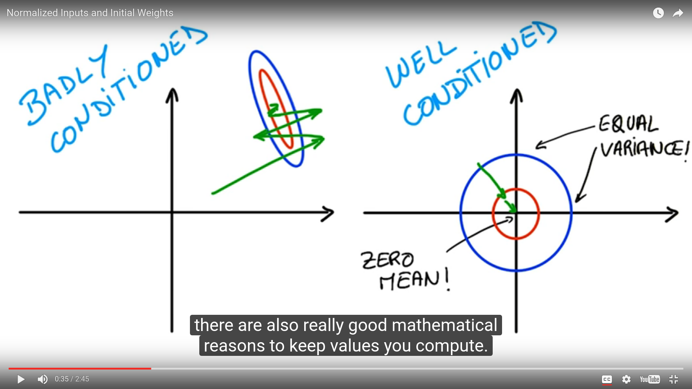

#Numerical Stability

When you do numerical computations you always have to worry about calculating values that are too large or too small. In particular, adding very small values to a very large value can introduce a lot of errors.

***

####Example

```python
a = 1000000000
for i in range(1000000):
    a = a + 1e-6
print(a - 1000000000)
```

####Output

```
0.953674316406
```

***

In the above example, the math says that the result should be 1.0 but the code says that the result should be 0.95...

If we change the 1000000000 to 1, then the error becomes much less:

```python
a = 1
for i in range(1000000):
    a = a + 1e-6
print(a - 1000000000)
```

####Output

```
0.999999999918
```

***

One good guiding principle is that we always want our variables to have zero mean and equal variance whenever possible. 



On top of the numerical issues, there are also really good mathematical reasons to keep values you compute roughly around a mean of zero and equal variance when you are doing optimization.

A badly conditioned problem means that the optimizer has to do a lot of searching to go and find a good solution

A well conditioned problem makes it easier for the optimizer to do its job

-

When you are dealing with images, it's simple. You can take the pixel value of your image - they are typically between 0 and 255 - and simply subtract 128 and divide by 128:

(R - 128)/128

(G - 128)/128

(B - 128)/128

It doesn't change the content of your image, but it makes it much easier for optimization to proceed numerically

-

You will also want your weights and biases to be initialized at a good enough starting point for gradient descent to proceed

There are lots of schemes to find good initialization values, but we are going to focus on a simple general method:

We will draw the weights randomly from a Gaussian distribution with mean zero and standard deviation sigma. The sigma value determines the order of magnitude of your outputs at the initial point of optimization. Because of the Softmax on top of it, the order of magnitude also determines the peakiness of your initial probability distribution. A large sigma means that your distribution will have large peaks (very opinionated). A small sigma means that your distribution is very uncertain about things. It is usually better to begin with an uncertain distribution and let the optimization become more confident as the training progresses. 

**Use a small sigma to begin with**

-

###Initialization of a Logistic Classifier

L = 1/N * (Summation i(D(S(w*x_i + b), L_i)))

Where the weights (w) are randomly generated on a given distribution, our inputs (x) are pixel RGB values that have been subtracted by and divided by 128, and our biases (b) is the small sigma value that we will begin with

Our optimization package computes the derivative of this loss with respect to the weights and to the biases
