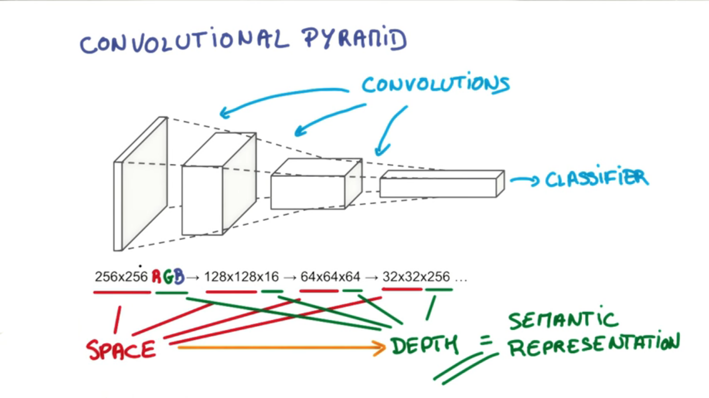
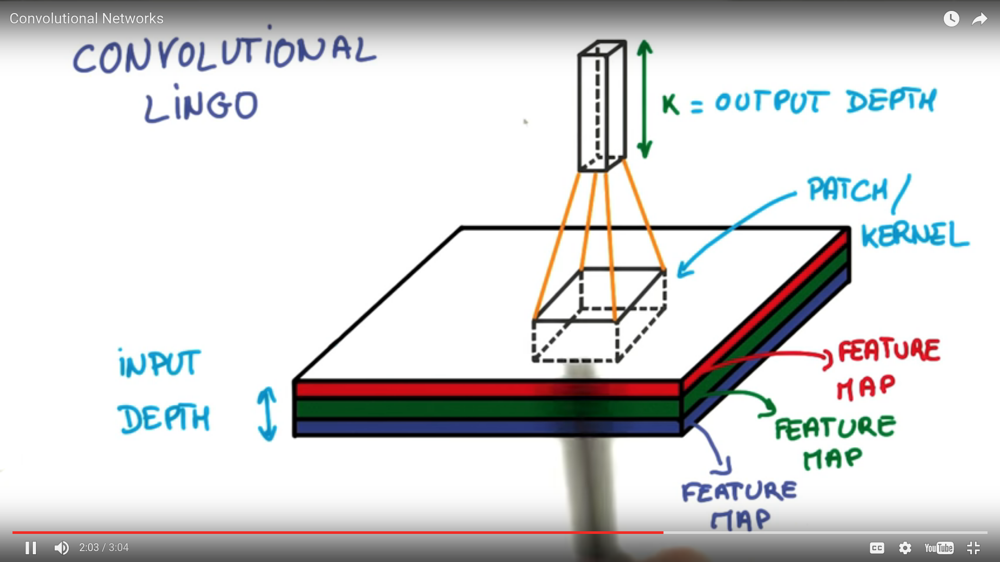

# Convolutional Networks (Covnets)

**Covnets** are neural networks that share parameters across space. Imagine you have an image. It has a width and a height, and since it has RGB channels, it also has a depth of 3 (RGB). This width, height, and depth are the inputs.

Now imagine taking a small patch of this image and running a tiny neural network on it with K outputs. Those outputs can be represented vertically in a tiny column. Now if we slide the neural network across the image without changing the weights across and vertically, we get an output that is another image. 

This output has a different width, height, and depth. Instead of the depth being R, G, and B you now have an output that has K color channels. This operation is called a convolution.

If your patch size was the size of the whole image, it would be no different than a regular layer of a neural network. Since we have this small patch instead, we have many fewer weights and they are shared across space. 

A covnet is going to basically be a deep neural network where instead of having stacks of matrix multipliers, we're going to have stacks of convolutions. The general idea is that they will form a Convolutional Pyramid:

At the bottom of the pyramid you have this big image that is very shallow in depth. Just RGB. You're going to apply convolutions that are going to progressively squeeze the spacial dimensions while increasing the depth, which corresponds roughly to the semantic complexity of your representation.

At the top of the pyramid you can put your classifier. You have a representation where all the spatial information has been squeezed out and only parameters that map to contents of the image remain. 

To implement this, there are lots of details to get right and a fair bit of lingo to get used to. You've met the concept of **patch** and **depth**. Patches are sometimes called *kernels*. Each layer of your stack is called a feature map. In the picture above, you're mapping three feature maps to K feature maps. 

Another important term is a **Stride**. A stride is the number of pixels that you're shifting every time you move your filter. A stride of 1 makes the output roughly the same size as the input. A stride of 2 makes the output about half the size of the input.

It is rough because it depends a bit about what you do at the edge of your image. Either, you don't go past the edge, and it is called *Valid Padding* as a shortcut. Or you go off the edge and pad zeros in such a way that the output map size is exactly the same as the input map called *Same Padding*. 
