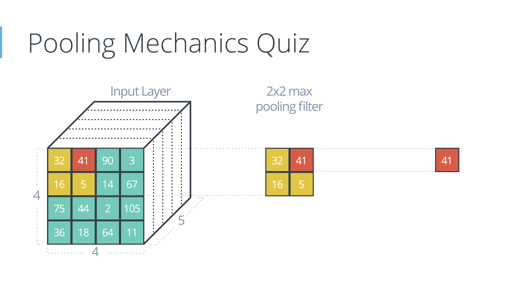

# Pooling Quizzes

### Quiz - Pooling Intuition

A pooling layer is generally used to ...

- Decrease the size of the output
- Prevent overfitting

The correct answer is decrease the size of the output and prevent overfitting. Reducing overfitting is a consequence of the reducing the output size, which in turn, reduces the number of parameters in future layers.

Recently, pooling layers have fallen out of favor. Some reasons are:

- Recent datasets are so big and complex we're more concerned about underfitting.
- Dropout is a much better regularizer.
- Pooling results in a loss of information. Think about the max pooling operation as an example. We only keep the largest of n numbers, thereby disregarding n-1 numbers completely.

***

### Quiz - Pooling Mechanics

Setup

H = height, W = width, D = depth

- We have an input of shape 4x4x5 (HxWxD)
- Filter of shape 2x2 (HxW)
- A stride of 2 for both the height and width (S)

Recall the formula for calculating the new height or width:

```
new_height = (input_height - filter_height)/S + 1
new_width = (input_width - filter_width)/S + 1
```

NOTE: For a pooling layer the output depth is the same as the input depth. Additionally, the pooling operation is applied individually for each depth slice.

The image below gives an example of how a max pooling layer works. In this case, the max pooling filter has a shape of 2x2. As the max pooling filter slides across the input layer, the filter will output the maximum value of the 2x2 square.



##### What's the shape of the output? Format is HxWxD.

Solution

The answer is 2x2x5. Here's how it's calculated using the formula:

```
(4 - 2)/2 + 1 = 2
(4 - 2)/2 + 1 = 2
```

The depth stays the same.

Here's the corresponding code:

```
input = tf.placeholder(tf.float32, (None, 4, 4, 5))
filter_shape = [1, 2, 2, 1]
strides = [1, 2, 2, 1]
padding = 'VALID'
pool = tf.nn.max_pool(input, filter_shape, strides, padding)
```

The output shape of pool will be [1, 2, 2, 5], even if **padding** is changed to **'SAME'**.

***

### Quiz - Pooling Practice

Great, now let's practice doing some pooling operations manually.

Max Pooling

What's the result of a max pooling operation on the input:

```
[[[0, 1, 0.5, 10],
   [2, 2.5, 1, -8],
   [4, 0, 5, 6],
   [15, 1, 2, 3]]]
```

Assume the filter is 2x2 and the stride is 2 for both height and width. The output shape is 2x2x1.

The answering format will be 4 numbers, each separated by a comma, such as: **1,2,3,4**.

Work from the top left to the bottom right

Solution

The correct answer is 2.5,10,15,6. We start with the four numbers in the top left corner. Then we work left-to-right and top-to-bottom, moving 2 units each time.

```
max(0, 1, 2, 2.5) = 2.5
max(0.5, 10, 1, -8) = 10
max(4, 0, 15, 1) = 15
max(5, 6, 2, 3) = 6
```

***

### Quiz - Average Pooling

Mean Pooling

What's the result of a average (or mean) pooling?


```
[[[0, 1, 0.5, 10],
   [2, 2.5, 1, -8],
   [4, 0, 5, 6],
   [15, 1, 2, 3]]]
```

Assume the filter is 2x2 and the stride is 2 for both height and width. The output shape is 2x2x1.

The answering format will be 4 numbers, each separated by a comma, such as: 1,2,3,4.

Answer to 3 decimal places. Work from the top left to the bottom right

Solution

The correct answer is 1.375,0.875,5,4. We start with the four numbers in the top left corner. Then we work left-to-right and top-to-bottom, moving 2 units each time.

```
mean(0, 1, 2, 2.5) = 1.375
mean(0.5, 10, 1, -8) = 0.875
mean(4, 0, 15, 1) = 5
mean(5, 6, 2, 3) = 4
```
