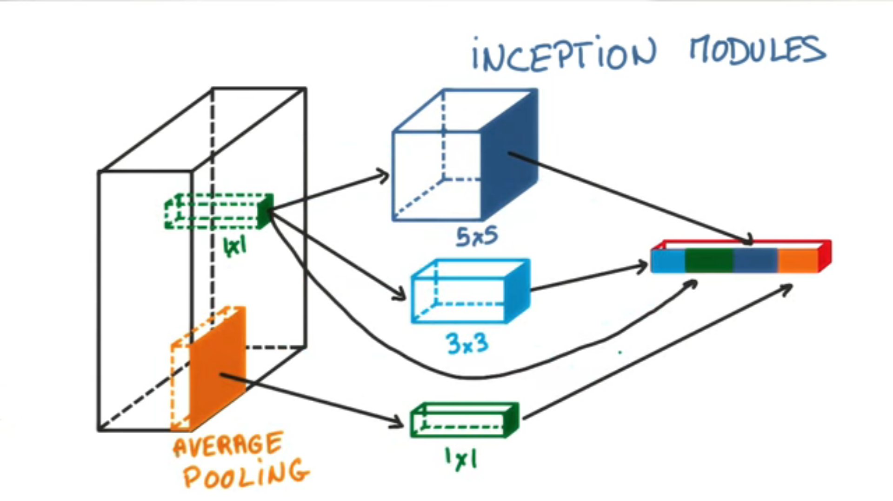

# Inception Models

We mentioned **Average Pooling** and **1x1 Convolutions** because it leads into a general strategy that has been very effective at creating covnets that are both smaller and better than covnets that simply use a pyramid of convolutions

***

The idea behind an **Inception Model** is that, at each layer of your covnets, you can make a choice. This choice could be to have a pooling operation, or have a convolution. Then you need to decide if it is a 1x1 convolution, or a 3x3, or a 5x5? All of these are actually beneficial to the modeling power of your network. 

So why choose? Let's use them all.

In the above picture you can see what an Inception Module looks like. Instead of having a single convolution, you have a composition of average pooling, followed by 1x1. Then 1x1 convolution followed by a 3x3. Then a 1x1 followed by a 5x5. At the top, you simply concatenate the output of each of them together.

It looks complicated, but what is interesting is that you can choose these parameters in such a way that the total number of parameters in you model is very small. Yet, the model performs better than if you had a single convolution. 
